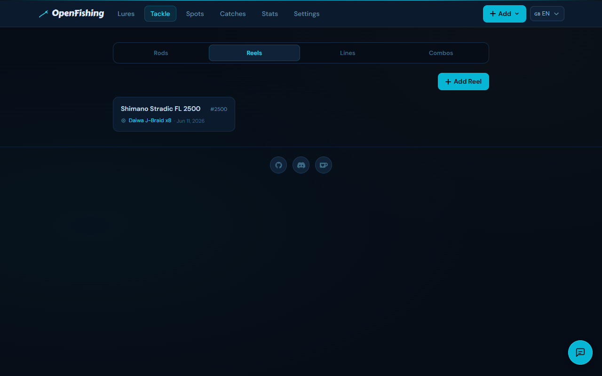
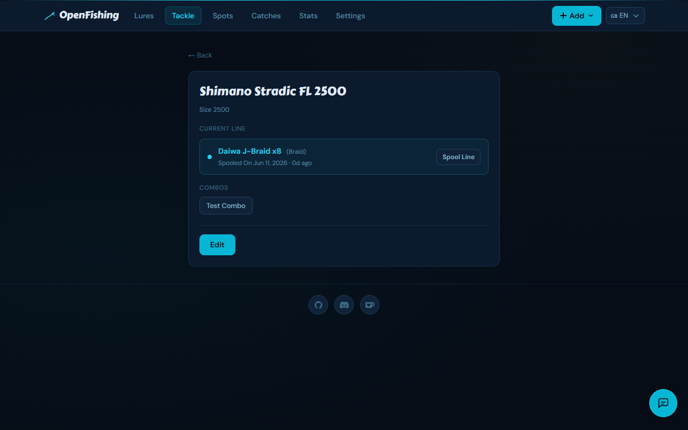

# OpenFishing

A self-hosted web app to organize your fishing lures, mark fishing spots, and log your catches.

## Screenshots

### Lures


### Spots


### Catches


### Stats


### Tackle





---

## Features

### Lures
- Add, edit, and delete lures with full metadata: name, brand, type, color, weight, size, running depth, water type, light conditions, fish species, notes
- **Pack size / amount** field — great for softbait bags and multi-packs
- Photo uploads per lure (file picker or camera capture)
- Tag support via chip input
- Mark lures as **favourites** (heart icon)
- Mark lures as **lost** — preserves all catch history without deleting the record, clears the QR label
- Sequential lure numbers (`#0001`) for easy reference
- Auto-suggest on text fields and fish species based on existing entries
- Include/exclude chip filters: type, running depth, light conditions, fish species, favourites, has catch — client-side, instant
- **QR code label generator** with compact print view (12.5×12.5mm labels)
- **Share links** — generate a public read-only link per lure, works even when auth is enabled

### Spots
- Add fishing spots by clicking on an interactive map or using GPS auto-locate
- Photo gallery per spot (multiple uploads)
- Tags and free-text notes
- Get Directions link (Google Maps)
- **Live weather & bite index** — current temperature, humidity, air pressure trend, moon phase, and a calculated bite index (Poor → Excellent) based on pressure trend, light conditions, and temperature stability
- View nearby catches on the spot detail page (within 100m)
- **Share links** — generate a public read-only link per spot

### Catches
- Log catches with species, length, weight, date/time, retrieve style, notes, and photos
- Place exact catch location on an interactive map (GPS auto-locate on mobile)
- **Bite index recorded at catch time** — snapshot of conditions when the catch was logged, shown on the detail page
- Automatically linked to the nearest defined spot within 100m
- Cross-references the lure used
- **Share links** — generate a public read-only link per catch

### Stats
- Trophy bar: total catches, species count, spots fished, C&R rate
- Personal bests per species (max length + weight)
- Top lures by catch count with C&R breakdown
- Top retrieve styles
- Monthly activity (last 12 months), time-of-day histogram, day-of-week breakdown
- Top spots by catch count

### Tackle
- Manage rods, reels, fishing lines, and tackle combos
- **Current line tracking** — log which line is spooled on each reel; current line shown prominently on the reel detail page
- **Spool history** — full log of line changes per reel with date and notes
- Link rods and reels into named combos; combos are selectable when logging a catch
- Available via REST API (`/api/v1/rods`, `/api/v1/reels`, `/api/v1/lines`, `/api/v1/combos`) and chatbot tools

### General
- English and German — auto-detected from browser, switchable via flag picker
- Optional password authentication via `AUTH_PASSWORD` env var
- Share links bypass authentication so individual records can be shared publicly without exposing the whole app
- **Demo mode** via `DEMO_MODE` env var — read-only view, all writes blocked, localized banner and toast inform users
- **REST API** — read-only JSON endpoints for external integrations (see below)
- **AI chatbot** — floating fishing-buddy chat widget; queries your lures, catches, and spots via tool use (see below)

## REST API

OpenFishing exposes a read-only REST API at `/api/v1/`. Interactive documentation is available at `/api-docs`.

### Authentication

When `AUTH_PASSWORD` is set the API requires a Bearer token on every request:

```
Authorization: Bearer <your_password>
```

When `AUTH_PASSWORD` is not set the endpoints are openly accessible.

### Endpoints

| Method | Path | Description |
|---|---|---|
| `GET` | `/api/v1/lures` | List all lures (includes tags) |
| `GET` | `/api/v1/lures/{id}` | Get a single lure by ID |
| `GET` | `/api/v1/spots` | List all spots (includes tags) |
| `GET` | `/api/v1/spots/{id}` | Get a single spot by ID |
| `GET` | `/api/v1/catches` | List all catches (includes linked lure name) |
| `GET` | `/api/v1/catches/{id}` | Get a single catch by ID |
| `GET` | `/api/v1/rods` | List all rods |
| `GET` | `/api/v1/rods/{id}` | Get a single rod by ID |
| `GET` | `/api/v1/reels` | List all reels (includes current line) |
| `GET` | `/api/v1/reels/{id}` | Get a single reel by ID (includes current line) |
| `GET` | `/api/v1/lines` | List all fishing lines |
| `GET` | `/api/v1/lines/{id}` | Get a single fishing line by ID |
| `GET` | `/api/v1/combos` | List all tackle combos (includes rod, reel, current line) |
| `GET` | `/api/v1/combos/{id}` | Get a single combo by ID |

### Example

```bash
curl -H "Authorization: Bearer yourpassword" https://fishing.yourdomain.com/api/v1/lures
```

## AI Chatbot

A floating fishing-buddy widget powered by any LLM via [LiteLLM](https://github.com/BerriAI/litellm). It has access to your lures, catches, and spots via tool use and can answer questions about your data or give tackle advice.

### Setup

The chatbot requires a LiteLLM proxy sidecar. A ready-to-use `docker-compose.yml` and `litellm.config.yaml` are included in the repository.

1. Copy `.env.example` to `.env` and fill in your API key(s):

```
ANTHROPIC_API_KEY=sk-ant-...   # for claude-sonnet
# or
OPENAI_API_KEY=sk-...          # for gpt-4o
```

2. Set the chatbot env vars (already present in `docker-compose.yml`):

```
CHATBOT=true
LITELLM_URL=http://litellm:4000
LITELLM_MODEL=claude-sonnet    # or gpt-4o — must match litellm.config.yaml
```

3. Start with Docker Compose:

```bash
docker compose up
```

LiteLLM is internal-only and not exposed publicly. The chatbot is available on all pages when enabled and works in demo mode (read-only queries only).

### Tools available to the AI

| Tool | Filters | Description |
|---|---|---|
| `get_lures` | `species`, `waterType`, `type`, `color`, `minLightConditions`, `maxLightConditions`, `includeLost`, `limit`, `offset` | Fetches lures with tags (max 20 per page) |
| `get_catches` | `species`, `limit` | Fetches catches with linked lure, most recent first |
| `get_spots` | `tag` | Fetches spots with tags |
| `get_rods` | `type`, `brand` | Fetches rods |
| `get_reels` | `brand` | Fetches reels with currently spooled line |
| `get_lines` | `type`, `brand` | Fetches fishing lines |
| `get_combos` | — | Fetches all combos with rod, reel, and current line |

The AI uses filter parameters automatically and cross-references current conditions — e.g. on a bright sunny day it will filter lures by `minLightConditions: 7` and suggest natural-coloured patterns. Lure names in responses are clickable links that navigate directly to the lure detail page.

## Running with Docker

```yaml
services:
  openfishing:
    image: ghcr.io/m1ndgames/openfishing:latest
    ports:
      - "3000:3000"
    volumes:
      - ./data:/app/data
      - ./uploads:/app/uploads
    environment:
      - DATABASE_URL=/app/data/openfishing.db
      - UPLOAD_PATH=/app/uploads
      - BASE_URL=https://fishing.yourdomain.com
      - AUTH_PASSWORD=your_secure_password   # omit to disable auth
      - DEMO_MODE=1                          # omit to allow writes
```

Database migrations run automatically on startup. The `data` and `uploads` volumes are the only state — back those up and you're covered.
