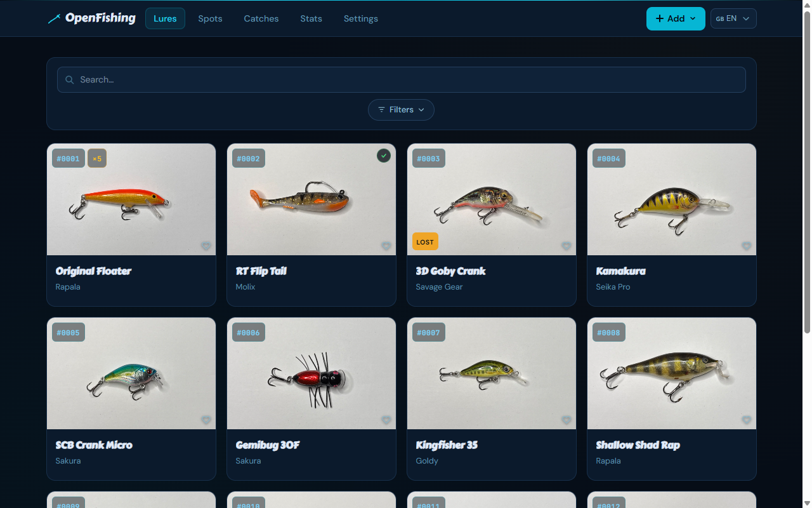
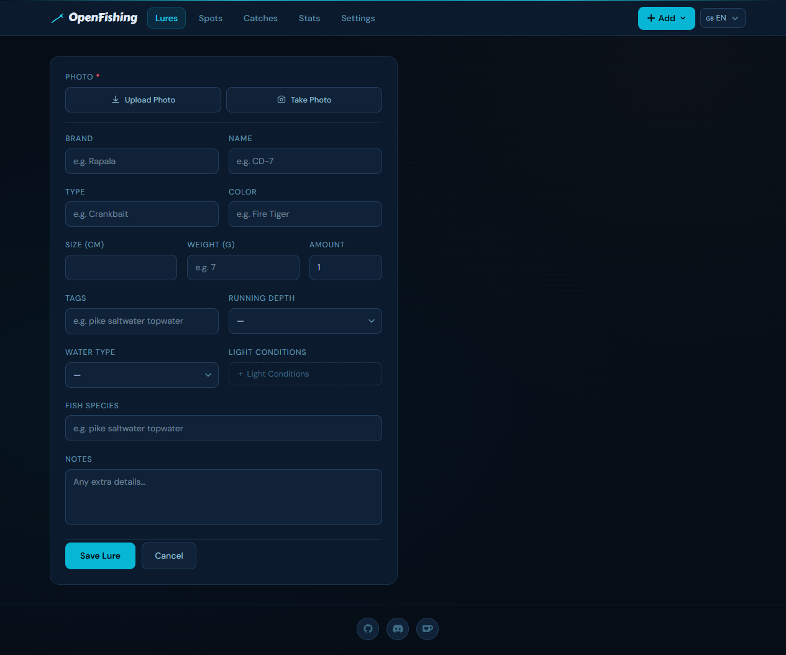
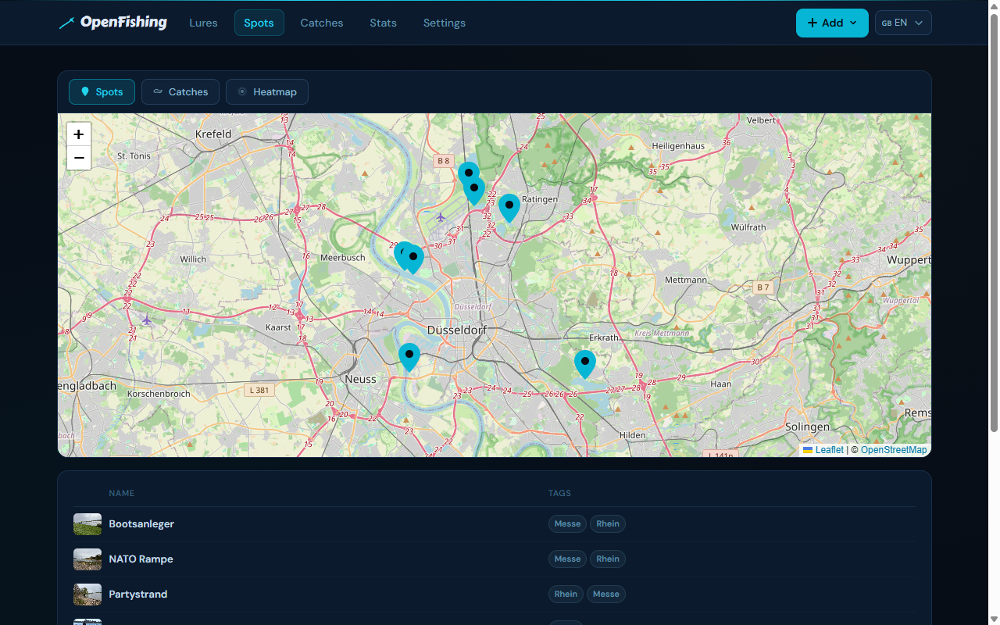
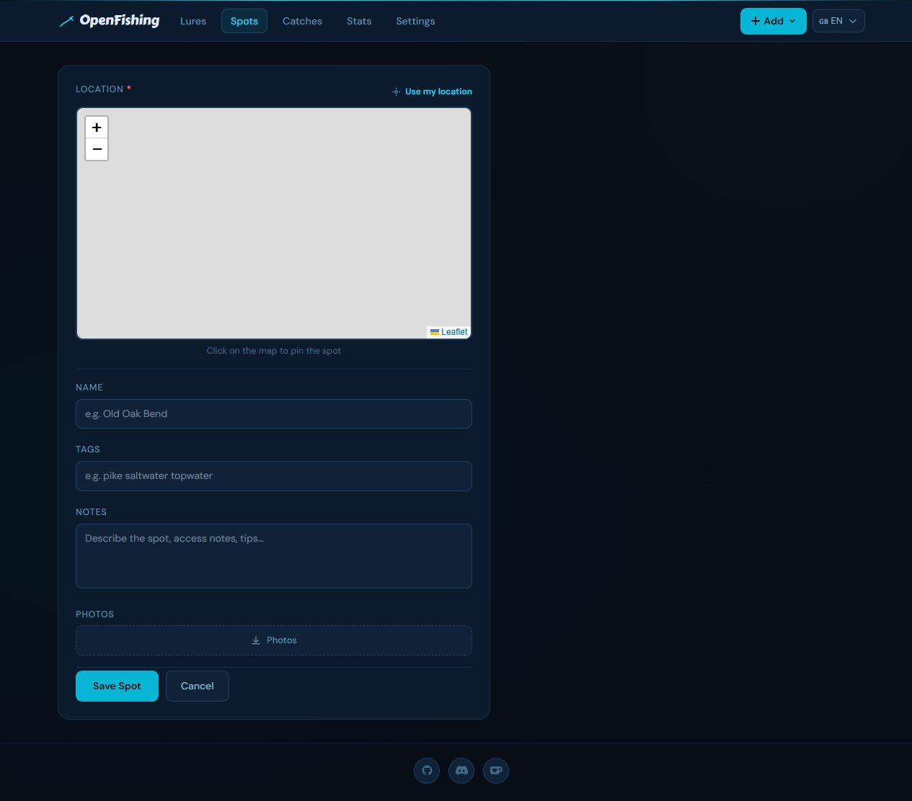
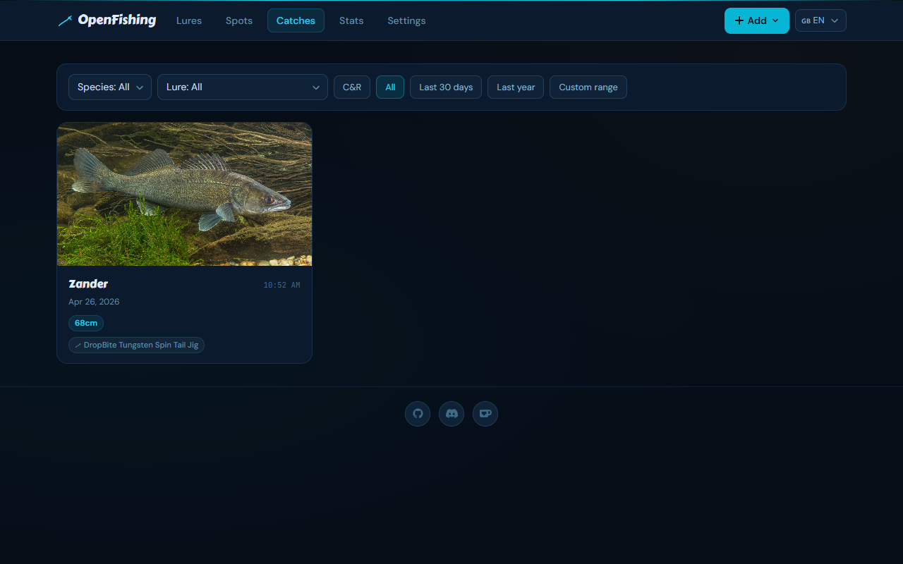
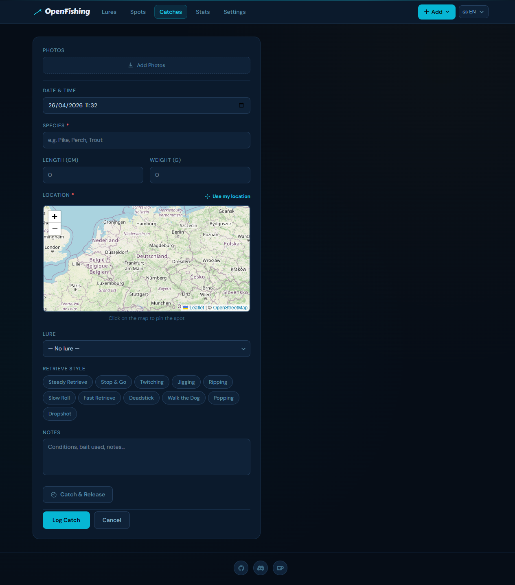
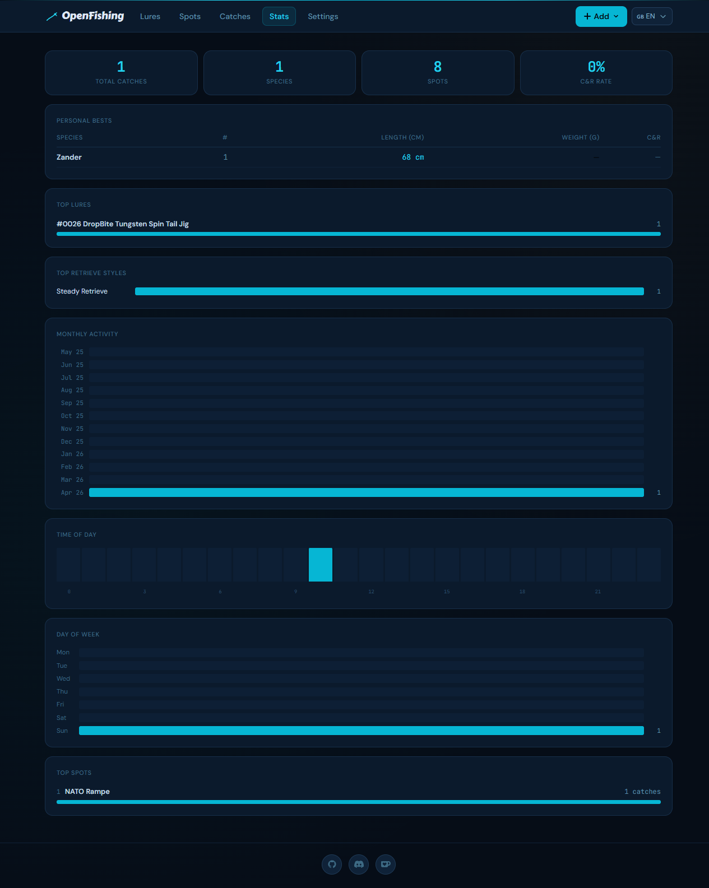

# OpenFishing

A self-hosted web app to organize your fishing lures, mark fishing spots, and log your catches.

## Screenshots

### Lures





### Spots





### Catches





### Stats



---

## Features

### Lures
- Add, edit, and delete lures with full metadata: name, brand, type, color, weight, size, running depth, water type, light conditions, fish species, notes
- **Pack size / amount** field — great for softbait bags and multi-packs
- Photo uploads per lure (file picker or camera capture)
- Tag support via chip input
- Mark lures as **favourites** (heart icon)
- Mark lures as **lost** — preserves all catch history without deleting the record, clears the QR label
- Sequential lure numbers (`#0001`) for easy reference
- Auto-suggest on text fields and fish species based on existing entries
- Include/exclude chip filters: type, running depth, light conditions, fish species, favourites, has catch — client-side, instant
- **QR code label generator** with compact print view (12.5×12.5mm labels)
- **Share links** — generate a public read-only link per lure, works even when auth is enabled

### Spots
- Add fishing spots by clicking on an interactive map or using GPS auto-locate
- Photo gallery per spot (multiple uploads)
- Tags and free-text notes
- Get Directions link (Google Maps)
- **Live weather & bite index** — current temperature, humidity, air pressure trend, moon phase, and a calculated bite index (Poor → Excellent) based on pressure trend, light conditions, and temperature stability
- View nearby catches on the spot detail page (within 100m)
- **Share links** — generate a public read-only link per spot

### Catches
- Log catches with species, length, weight, date/time, retrieve style, notes, and photos
- Place exact catch location on an interactive map (GPS auto-locate on mobile)
- **Bite index recorded at catch time** — snapshot of conditions when the catch was logged, shown on the detail page
- Automatically linked to the nearest defined spot within 100m
- Cross-references the lure used
- **Share links** — generate a public read-only link per catch

### Stats
- Trophy bar: total catches, species count, spots fished, C&R rate
- Personal bests per species (max length + weight)
- Top lures by catch count with C&R breakdown
- Top retrieve styles
- Monthly activity (last 12 months), time-of-day histogram, day-of-week breakdown
- Top spots by catch count

### General
- English and German — auto-detected from browser, switchable via flag picker
- Optional password authentication via `AUTH_PASSWORD` env var
- Share links bypass authentication so individual records can be shared publicly without exposing the whole app

## Running with Docker

```yaml
services:
  openfishing:
    image: ghcr.io/m1ndgames/openfishing:latest
    ports:
      - "3000:3000"
    volumes:
      - ./data:/app/data
      - ./uploads:/app/uploads
    environment:
      - DATABASE_URL=/app/data/openfishing.db
      - UPLOAD_PATH=/app/uploads
      - BASE_URL=https://fishing.yourdomain.com
      - AUTH_PASSWORD=your_secure_password   # omit to disable auth
```

Database migrations run automatically on startup. The `data` and `uploads` volumes are the only state — back those up and you're covered.
